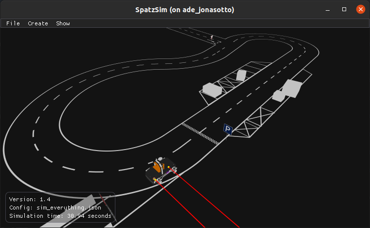

# SpatzSim



This is the Carolo-Cup simulator of Team Spatzenhirn.

The following aspects are simulated:

* Vehicle motion using Pacejka's tire model
* Primary high-resolution color camera, bayer encoded
* Depth camera: Currently configured for the resolution of two side-by-side Intel D435
* Laser distance sensors on the right side of the vehicle
* Static obstacles
* Dynamic obstacles: Motion triggered by arriving vehicle
* Many static objects, such as road signs, floor markings, giraffe, parking sections, startbox, etc
* Lane markings: Straight section, curved sections and crossings with arbitrary number of entries
  and arbitrary angles, placed in interactive editor

IMU, wheel encoder and steering angle sensors are not currently simulated.
The entire vehicle state (with perfect odometry and position data) is available as
an output.

A rule-checking module is included, which we use for automated testing.

ROS nodes adapting the custom communication interface to ROS can be found in the
[teamspatzenhirn_simulator_interface](https://github.com/teamspatzenhirn/teamspatzenhirn_simulator_interface)
package.

We know that documentation on how to use the simulator is currently rather sparse.
If you are trying to use the simulator and need assistance, feel free to open an issue.
If you have the simulator up and running, open the keyboard shortcut help page from the menu
under `Show->Help`!

## Getting the source

This repo uses git LFS for storage of the 3D model.
Run `git lfs pull` after cloning to download all models.

## Build

SpatzSim is build using CMake (version > 3.0) and a compiler supporting C++17.
Most dependencies are included directly in the git repository. Additionally,
SpatzSim requires GLFW and GLEW to be installed as system libraries. On Ubuntu
18.04, 20.04 or 22.04 these can be installed with:

```
sudo apt install libglfw3-dev libglew-dev
```

To build the simulator execute the following in the project directory:

```
mkdir build
cd build
cmake ..
make
```

To build and run the simulator the "run" target is used:

```
make run
```

## Necessary shared libraries:

The following dependencies must be installed as shared libraries on the system:

### GLEW

Used to load OpenGL extensions.

http://glew.sourceforge.net/

### GLFW

Provides an OpenGL context, a window and simple input handling.

https://www.glfw.org/
https://github.com/glfw/glfw

## Libraries included in repository:

The following additional libraries are used internally and are included in the repository.

### GLM

GLSL like matrix and vector math library for C++.

https://github.com/g-truc/glm
https://glm.g-truc.net/0.9.9/index.html

### ImGui

Immediate mode OpenGL gui library.

https://github.com/ocornut/imgui

### OBJ-Loader

Loads 3D model in the .obj (and corresponding .mtl) file format.

https://github.com/Bly7/OBJ-Loader

### Json11

A json library for modern C++. Used to save and load configurations.

https://github.com/nlohmann/json

## Contributing

Contributions are welcomed and encouraged.
We would love to hear from you if this simulator is helpful to you and your Carolo-Cup team.
If you would like to contribute and don't know where to start, take a look at the issues labeled
[good first issue](https://github.com/teamspatzenhirn/Simulator/labels/good%20first%20issue)!
